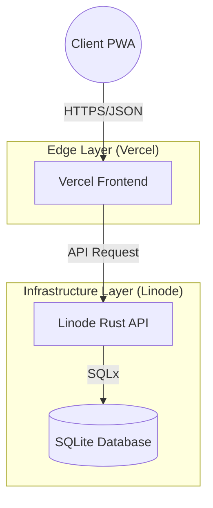
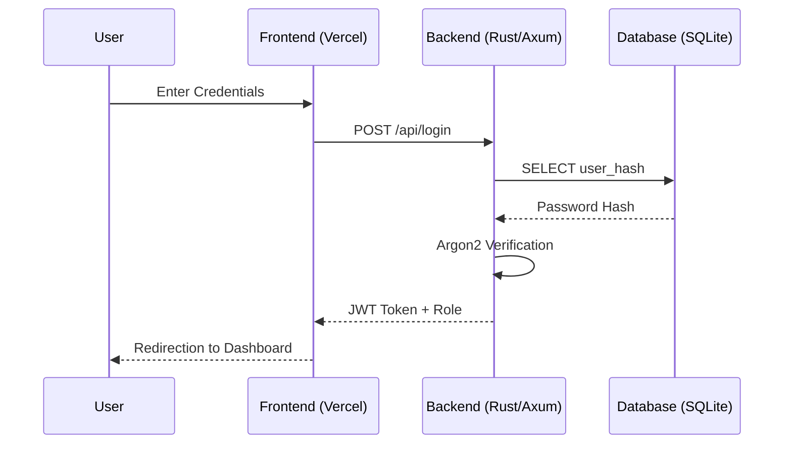
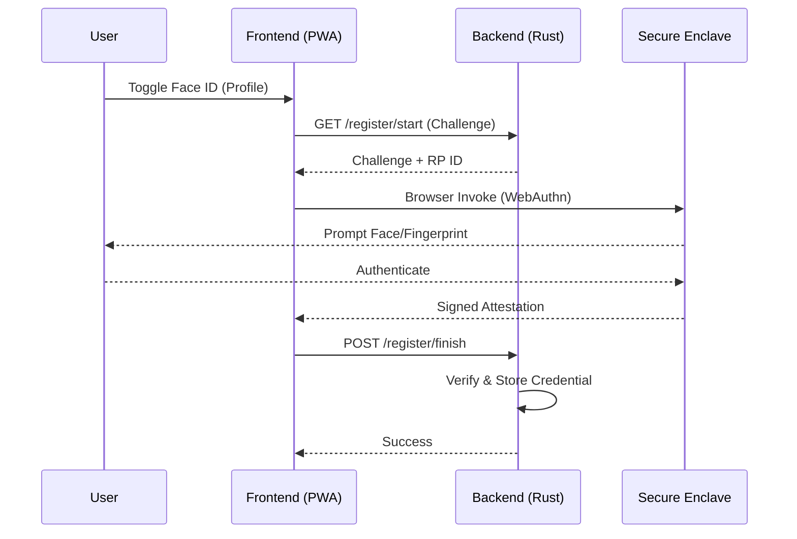
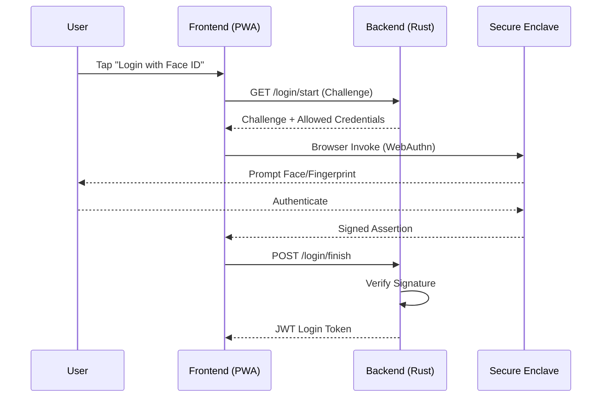

# 🐕 Vanguard Kennel Systems | Premium Pet Care

Vanguard is a high-end kennel management platform designed for performance, security, and a premium user experience. Built with a decoupled architecture, it leverages a high-performance Rust backend and a modern Next.js frontend.

## 🏗️ System Architecture

Vanguard uses a modern, decoupled architecture for maximum security and performance.

## 🔒 Security Flow

Vanguard employs a defense-in-depth strategy to ensure user data remains private.

## 🚀 Key Features

- **Blazing Fast Backend**: Powered by Rust (Axum + Tokio) for unmatched concurrency.
- **Bank-Grade Security**: Argon2 password hashing and TLS 1.3 encryption.
- **Decoupled Privacy**: Physical isolation between frontend and backend servers.
- **Premium UI**: Material UI components with a glassmorphism aesthetic.
- **Rich Data Seeding**: Complete demo environment with 12+ VIP clients and audit logs.

## 🛡️ Biometric Authentication (WebAuthn)

Vanguard provides cutting-edge security via **WebAuthn (Face ID / Touch ID)**. This allows users to authenticate without passwords using their device's hardware security module.

### How it works

Vanguard implements the FIDO2/WebAuthn standard, ensuring that your biometric data **never leaves your device**. Only a cryptographically signed "challenge" is sent to our Rust backend.

#### 1. Registration Flow

#### 2. Authentication (Login) Flow

## 🛠️ Tech Stack

- **Frontend**: Next.js 14, Material UI, Emotion, PWA, `@simplewebauthn/browser`.
- **Backend**: Rust, Axum, SQLx, Argon2, `webauthn-rs`.
- **Database**: SQLite.
- **Infrastructure**: Vercel (Frontend), Linode VPS (Backend).

---
© 2025 Vanguard Kennel Systems. All Rights Reserved.
