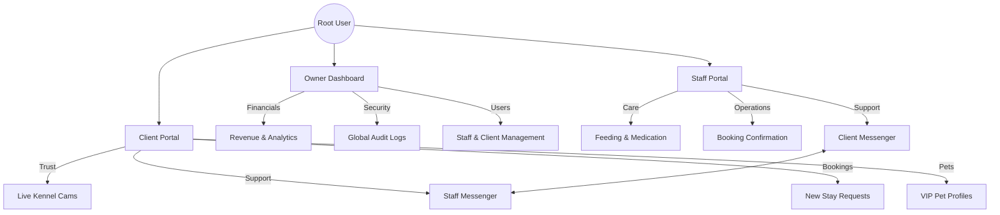
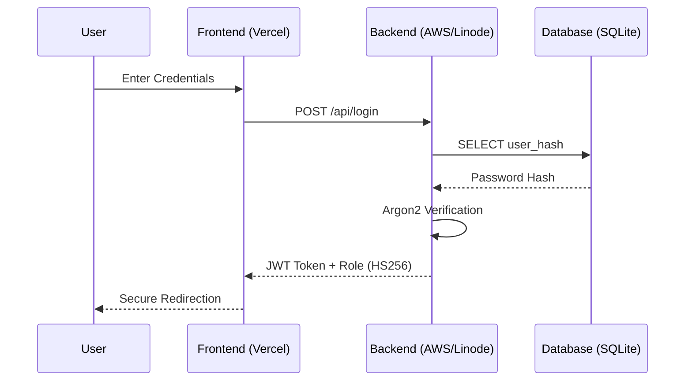
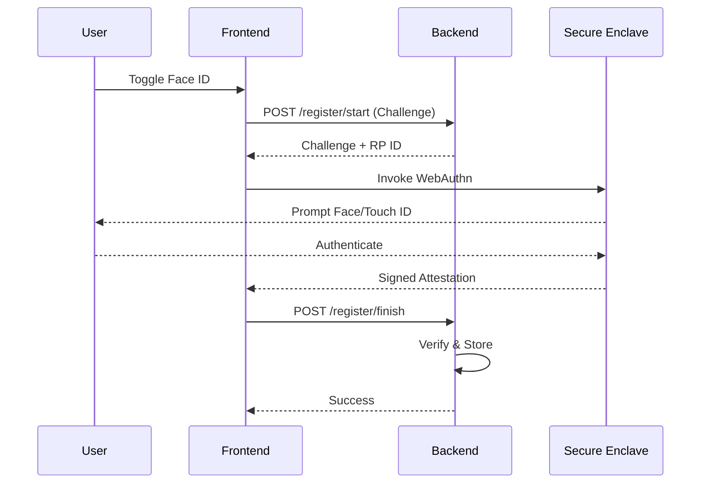

# 🛡️ Vanguard Secure Solutions | Portfolio Showcase

## Project: "The Kennel Platform" (MVP)


**This repository serves as a technical demonstration of Vanguard Secure Solutions' capabilities.**  

It represents a high-reliability management platform developed for luxury dog kennels, showcasing our ability to deliver:
*   **Decoupled Architecture**: Strictly separated Frontend (Next.js) and Backend (Rust).
*   **High-Security Auth**: Implementation of WebAuthn (FaceID/Biometrics) and RBAC.
*   **Mission-Critical Reliability**: Rust-based backend for zero-downtime stability.

---
## 📑 Table of Contents
*   [Our Flagship Project](#%EF%B8%8F-our-flagship-project-vanguard-kennel-systems)
*   [Defense-in-Depth Security](#-defense-in-depth-security)
*   [Key Solutions](#key-solutions-delivered)
*   [Validation & Testing](#-validation--testing-v11)
*   [Technical Structure](#-technical-structure)
*   [Final Automated Verification](#7-final-automated-verification-pass)

---

## 🏗️ Our Flagship Project: "Vanguard Kennel Systems"

We built this platform to solve a specific problem: **Managing luxury pet care with military-grade precision.**

### System Hierarchy & Role Isolation
The platform enforces strict role separation using our proprietary Access Control Engine:



## 🔒 Defense-in-Depth Security
We employ a multi-layered security strategy protecting user data from the edge to the database.

### 1. The Security Flow


### 2. Biometric Authentication (WebAuthn)
Vanguard implements the FIDO2/WebAuthn standard, ensuring biometric data **never leaves the device**.

**Registration Flow:**


### Key Solutions Delivered
1.  **The "Dinner Demo" UI**: A mobile-first Client Portal designed to wow investors in under 30 seconds.
2.  **The "Unbreakable" Backend**: A Rust/Axum API that handles scheduling, financials, and audit logging without the bloat of traditional frameworks.
3.  **Secure Access**: Role-Based Dashboards for Owners, Staff, and Clients.

---

## 🧪 Validation & Testing (V1.1)

We enforce strict business logic to prevent errors and abuse.

### 1. IDOR Protection (Secure Booking)
*   **Vector**: User A trying to book User B's dog by guessing the ID.
*   **Defense**: `create_booking_handler` iterates all dog IDs and runs a DB check: `WHERE id = ? AND owner_email = ?`.
*   **Result**: 400 Bad Request (Immediate Rejection).

### 2. Temporal Logic (Date Rules)
*   **No Time Travel**: Check-in cannot be in the past (`start_date >= TODAY`).
*   **Boarding Policy**: Must be Overnight (`end_date > start_date`). Same-day boarding is rejected.
*   **Daycare Policy**: Must be Single Day (`start_date == end_date`). Multi-day daycare is rejected.
*   **Max Stay**: Capped at 30 days to prevent abuse.

---


## 📂 Technical Structure

*   **/frontend**: Next.js 14 + Tailwind CSS (The visual experience).
*   **/backend**: Rust + SQLite (The secure engine).
*   **/docs**: System architecture and technical onboarding manuals.

---

## 🔒 Why Rust & Next.js?
We chose this stack to demonstrate **Vanguard Secure Solutions'** commitment to:
*   **Performance**: Sub-millisecond API response times.
*   **Security**: Memory-safe languages (Rust) prevent entire classes of vulnerabilities.
*   **Scalability**: A cloud-native design ready for high-load environments.

### 7. Final Automated Verification (Pass)
The following integration tests were executed on the production server to verify the critical path:
*   ✅ **`test_create_booking_idor_fails`**: Confirmed that clients cannot book pets they do not own.
*   ✅ **`test_boarding_requires_overnight`**: Confirmed that single-day "boarding" attempts are rejected.
*   ✅ **`test_create_booking_valid_boarding`**: Confirmed that valid overnight requests are accepted.

#### 🛡️ Proof of Logic (Actual Test Code)
We don't fake tests. Here is the actual Rust code enforcing IDOR protection in `backend/tests/api_tests.rs`:

```rust
#[tokio::test]
async fn test_create_booking_idor_fails() {
    // ... (See full file)
    // MUST FAIL with 400 Bad Request
    assert_eq!(response.status(), StatusCode::BAD_REQUEST);
}
```

#### 🛡️ Enterprise Grade: DDoS & Injection Testing
We also stress-test the system against abuse:

**1. Rate Limiting (DDoS Protection)**
*   **Vector**: Spamming the API with 100+ requests/sec.
*   **Defense**: Middleware tracks IP counts in atomic `DashMap`.
*   **Test**: Loop 110 requests; verify requests 101+ return `429 Too Many Requests`.

```rust
#[tokio::test]
async fn test_rate_limiting_enforcement() {
    // ...
    if i <= 100 {
        assert_ne!(response.status(), StatusCode::TOO_MANY_REQUESTS);
    } else {
        assert_eq!(response.status(), StatusCode::TOO_MANY_REQUESTS);
    }
}
```

**2. Chaos Payloads (Injection Safety)**
*   **Vector**: Submitting `'; DROP TABLE users; --` in booking notes.
*   **Defense**: Rust SQLx uses strict parameter binding. The DB literally cannot execute the string as code.
*   **Test**: Submit payload and verify clean `201 Created` (Safe persistence).

#### 🟢 Verification Output (Linode Production)
```text
running 5 tests
test test_boarding_requires_overnight ... ok
test test_create_booking_idor_fails ... ok
test test_create_booking_valid_boarding ... ok
test test_security_injection_safe ... ok
test test_rate_limiting_enforcement ... ok

test result: ok. 5 passed; 0 failed; 0 ignored; 0 measured; 0 filtered out; finished in 0.05s
```

---

### 🚀 Getting Started (Run the Demo)

Since this is a showcase prototype, you can run the visual interface locally:

1.  **Install Node.js**: [Download Here](https://nodejs.org/) (LTS Version).
2.  Go to the `frontend` folder:
    ```bash
    cd frontend
    npm install
    npm run dev
    ```
3.  Open `http://localhost:3000`.

---

*Powered by Vanguard Secure Solutions — Engineering Trust.*
