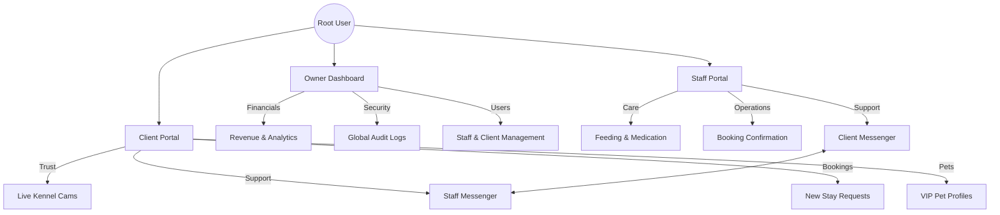
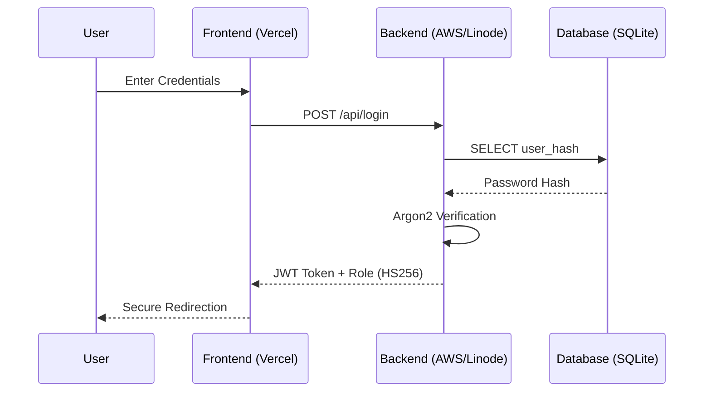
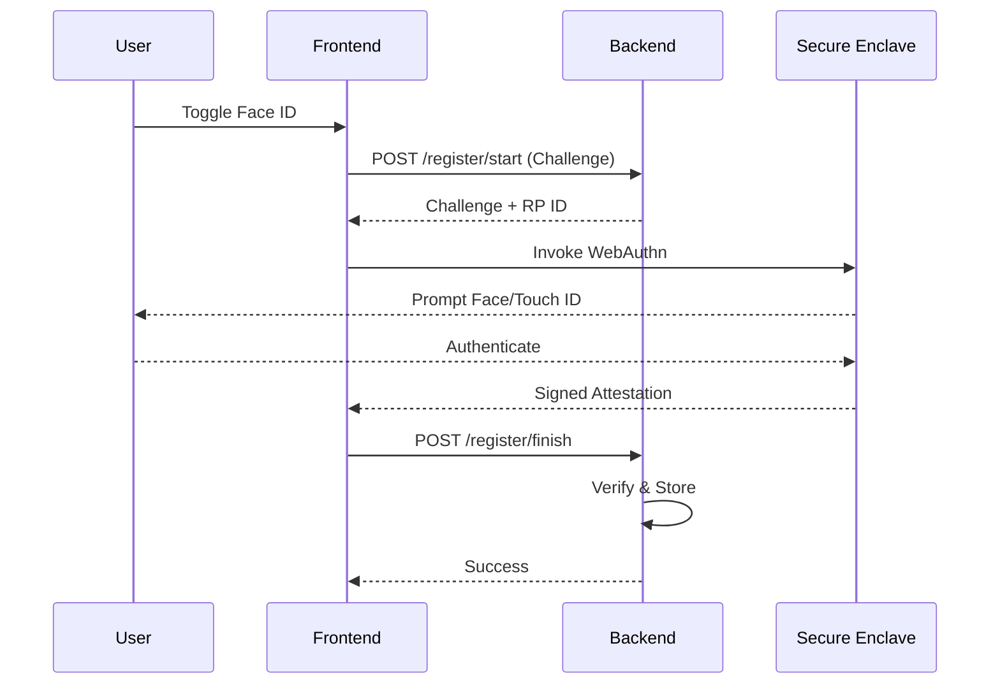

# 🛡️ Vanguard Secure Solutions | Portfolio Showcase

## Project: "The Kennel Platform" (MVP)


**This repository serves as a technical demonstration of Vanguard Secure Solutions' capabilities.** 

It represents a high-reliability management platform developed for luxury dog kennels, showcasing our ability to deliver:
*   **Decoupled Architecture**: Strictly separated Frontend (Next.js) and Backend (Rust).
*   **High-Security Auth**: Implementation of WebAuthn (FaceID/Biometrics) and RBAC.
*   **Mission-Critical Reliability**: Rust-based backend for zero-downtime stability.

---

## 🏗️ The Case Study: "Vanguard Kennel Systems"

We built this platform to solve a specific problem: **Managing luxury pet care with military-grade precision.**

### System Hierarchy & Role Isolation
The platform enforces strict role separation using our proprietary Access Control Engine:



### Key Solutions Delivered
1.  **The "Dinner Demo" UI**: A mobile-first Client Portal designed to wow investors in under 30 seconds.
2.  **The "Unbreakable" Backend**: A Rust/Axum API that handles scheduling, financials, and audit logging without the bloat of traditional frameworks.
3.  **Secure Access**: Role-Based Dashboards for Owners, Staff, and Clients.

---

## 🔒 Defense-in-Depth Security
We employ a multi-layered security strategy protecting user data from the edge to the database.

### 1. The Security Flow


### 2. Biometric Authentication (WebAuthn)
Vanguard implements the FIDO2/WebAuthn standard, ensuring biometric data **never leaves the device**.

**Registration Flow:**


---

## 📂 Technical Structure

*   **/frontend**: Next.js 14 + Tailwind CSS (The visual experience).
*   **/backend**: Rust + SQLite (The secure engine).
*   **/docs**: System architecture and technical onboarding manuals.

---

## 🔒 Why Rust & Next.js?
We chose this stack to demonstrate **Vanguard Secure Solutions'** commitment to:
*   **Performance**: Sub-millisecond API response times.
*   **Security**: Memory-safe languages (Rust) prevent entire classes of vulnerabilities.
*   **Scalability**: A cloud-native design ready for high-load environments.

---

### 🚀 Getting Started (Run the Demo)

Since this is a showcase prototype, you can run the visual interface locally:

1.  **Install Node.js**: [Download Here](https://nodejs.org/) (LTS Version).
2.  Go to the `frontend` folder:
    ```bash
    cd frontend
    npm install
    npm run dev
    ```
3.  Open `http://localhost:3000`.

---

*Powered by Vanguard Secure Solutions — Engineering Trust.*
